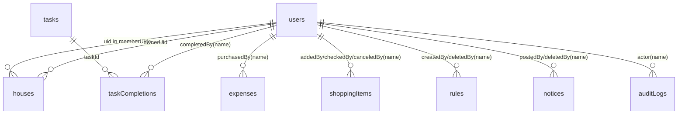

# DATABASE 設計図（Firestore）

## 1. 前提
- DB は Firestore を使用（RDB の「テーブル」相当は `collection`）。
- 本ドキュメントは現行実装（`src/server/*-store.ts`, `src/app/api/**/route.ts`）準拠。
- セキュリティルールは「クライアントからの Firestore 直接 read/write を禁止（API 経由のみ）」を採用。

## 2. 論理ER（コレクション関連）


注記:
- 実装上、履歴系の `*By` は UID ではなく表示名（`actor.name`）を保存。
- `actor.name` は「記録時の表示名スナップショットを固定保存」し、後日の表示名変更では履歴を再解決しない。
- Firestore は FK 制約なし。関連整合性は API 層で担保。

## 3. コレクション定義

### `users`
- 用途: ユーザープロフィール（Auth UID と表示名の対応）。
- ドキュメントID: `uid`（Firebase Auth UID）。

| field | type | 必須 | 説明 |
|---|---|---|---|
| `name` | string | Yes | 表示名 |
| `color` | string | Yes | UI色（hex等） |
| `email` | string | Yes | メールアドレス |

### `houses`
- 用途: ハウス情報と所属メンバー管理。
- ドキュメントID: 自動採番。

| field | type | 必須 | 説明 |
|---|---|---|---|
| `name` | string | Yes | ハウス名 |
| `description` | string | Yes | 説明（空文字あり） |
| `ownerUid` | string \| null | Yes | 所有者 UID |
| `memberUids` | string[] | Yes | 所属ユーザー UID 配列 |
| `createdAt` | string(ISO8601) | Yes | 作成日時 |

### `tasks`
- 用途: 家事マスタ（論理削除あり）。
- ドキュメントID: 自動採番。

| field | type | 必須 | 説明 |
|---|---|---|---|
| `name` | string | Yes | タスク名 |
| `category` | enum string | Yes | `炊事・洗濯` 等 |
| `points` | number(int>=1) | Yes | 貢献ポイント |
| `frequencyDays` | number(int>=1) | Yes | 推奨周期（日） |
| `deletedAt` | string(ISO8601) \| null | Yes | 論理削除日時 |

### `taskCompletions`
- 用途: タスク完了履歴（取消あり）。
- ドキュメントID: 自動採番。

| field | type | 必須 | 説明 |
|---|---|---|---|
| `taskId` | string | Yes | `tasks` のID |
| `taskName` | string | Yes | 完了時点のタスク名スナップショット |
| `points` | number | Yes | 完了時点のポイント |
| `completedBy` | string | Yes | 実行者名 |
| `completedAt` | string(ISO8601) | Yes | 完了日時 |
| `source` | `"app"` | Yes | 登録元 |
| `canceledAt` | string(ISO8601) \| null | Yes | 取消日時 |
| `canceledBy` | string \| null | Yes | 取消者名 |
| `cancelReason` | string \| null | Yes | 取消理由 |

### `expenses`
- 用途: 共益費支出履歴（取消あり）。
- ドキュメントID: 自動採番。

| field | type | 必須 | 説明 |
|---|---|---|---|
| `title` | string | Yes | 品目 |
| `amount` | number(>0) | Yes | 金額 |
| `category` | enum string | Yes | `水道・光熱費` 等 |
| `purchasedBy` | string | Yes | 購入者名 |
| `purchasedAt` | string(`YYYY-MM-DD`) | Yes | 購入日（日付文字列） |
| `canceledAt` | string(ISO8601) \| null | Yes | 取消日時 |
| `canceledBy` | string \| null | Yes | 取消者名 |
| `cancelReason` | string \| null | Yes | 取消理由 |

### `shoppingItems`
- 用途: 買い物リスト（チェック/取消あり）。
- ドキュメントID: 自動採番。

| field | type | 必須 | 説明 |
|---|---|---|---|
| `name` | string | Yes | 品名 |
| `quantity` | string | Yes | 数量（自由入力） |
| `memo` | string | Yes | メモ |
| `category` | enum string \| null | Yes | 費目カテゴリ |
| `addedBy` | string | Yes | 追加者名 |
| `addedAt` | string(`YYYY-MM-DD`) | Yes | 追加日 |
| `checkedBy` | string \| null | Yes | 購入チェック実行者名 |
| `checkedAt` | string(`YYYY-MM-DD`) \| null | Yes | 購入チェック日 |
| `canceledAt` | string(`YYYY-MM-DD`) \| null | Yes | 取消日 |
| `canceledBy` | string \| null | Yes | 取消者名 |

### `rules`
- 用途: ハウスルール（更新/確認/論理削除あり）。
- ドキュメントID: 自動採番。

| field | type | 必須 | 説明 |
|---|---|---|---|
| `title` | string | Yes | ルールタイトル |
| `body` | string | Yes | 本文 |
| `category` | enum string | Yes | `ゴミ捨て` 等 |
| `createdBy` | string | Yes | 作成者名 |
| `createdAt` | string(ISO8601) | Yes | 作成日時 |
| `updatedAt` | string(ISO8601) | No | 更新日時 |
| `acknowledgedBy` | string[] | Yes | 確認済みメンバー名 |
| `deletedAt` | string(ISO8601) \| null | Yes | 論理削除日時 |
| `deletedBy` | string \| null | Yes | 削除者名 |

### `notices`
- 用途: お知らせ（論理削除あり）。
- ドキュメントID: 自動採番。

| field | type | 必須 | 説明 |
|---|---|---|---|
| `title` | string | Yes | タイトル |
| `body` | string | Yes | 本文 |
| `postedBy` | string | Yes | 投稿者名 |
| `postedAt` | string(ISO8601) | Yes | 投稿日時 |
| `isImportant` | boolean | Yes | 重要通知フラグ |
| `deletedAt` | string(ISO8601) \| null | Yes | 論理削除日時 |
| `deletedBy` | string \| null | Yes | 削除者名 |

### `contributionSettings`
- 用途: 共益費設定履歴（月単位の時系列）。
- ドキュメントID: `YYYY-MM`（例: `2026-03`）。

| field | type | 必須 | 説明 |
|---|---|---|---|
| `monthlyAmountPerPerson` | number(>0) | Yes | 1人あたり月額 |
| `memberCount` | number(int>=1) | Yes | 対象人数 |
| `effectiveMonth` | string(`YYYY-MM`) | Yes | 適用開始月 |

補足:
- 初回 read 時に `2000-01` のデフォルト設定を自動作成。

### `auditLogs`
- 用途: 操作監査ログ。
- ドキュメントID: 自動採番。

| field | type | 必須 | 説明 |
|---|---|---|---|
| `action` | enum string | Yes | `rule_created` 等 |
| `actor` | string | Yes | 実行者名 |
| `source` | `"app"` \| `"system"` | Yes | 発生源 |
| `createdAt` | string(ISO8601) | Yes | 発生日時 |
| `details` | map | Yes | 追加情報（可変） |

## 4. 主要クエリとインデックス観点
- `auditLogs`: `orderBy(createdAt desc)`
- `expenses`: `orderBy(purchasedAt desc)`
- `notices`: `orderBy(postedAt desc)`
- `rules`: `orderBy(createdAt desc)`
- `shoppingItems`: `orderBy(addedAt desc)`
- `taskCompletions`: `orderBy(completedAt desc)`
- `houses`: `orderBy(createdAt desc)`
- `tasks`: `where(deletedAt == null)`

注記:
- 上記は単一フィールドクエリのみ。Firestore の自動単一フィールドインデックスで通常対応可能。

## 5. 実装ルール（運用）
- 論理削除: `tasks`, `rules`, `notices` は `deletedAt` で管理。
- 取消: `taskCompletions`, `expenses`, `shoppingItems` は `canceledAt` 系で管理。
- 履歴系 `*By` / `actor` は表示名のスナップショット固定（UID 再解決はしない）。
- 日付フォーマットは混在:
  - 日時: ISO8601（例 `2026-03-02T08:15:30.000Z`）
  - 日付: `YYYY-MM-DD`（例 `2026-03-02`）

## 6. `tasks` デフォルト初期データ（seed）
`tasks` テーブル定義（`name/category/points/frequencyDays/deletedAt`）に合わせた seed 一覧。

| name | category | points | frequencyDays | deletedAt |
|---|---|---:|---:|---|
| 【料理】共有の食事 | 炊事・洗濯 | 20 | 3 | null |
| 【料理】洗い物・片付け | 炊事・洗濯 | 20 | 1 | null |
| 【キッチン】排水溝ネット交換 | 炊事・洗濯 | 10 | 14 | null |
| 【キッチン】生ゴミ捨て | 炊事・洗濯 | 10 | 3 | null |
| 【洗濯】共有カゴの洗濯 | 炊事・洗濯 | 20 | 7 | null |
| 【洗濯】干す・取り込む | 炊事・洗濯 | 20 | 3 | null |
| 【洗濯】洗剤・柔軟剤の補充 | 炊事・洗濯 | 10 | 30 | null |
| 【風呂】浴槽の掃除 | 水回りの掃除 | 20 | 7 | null |
| 【風呂】床・壁の掃除 | 水回りの掃除 | 20 | 7 | null |
| 【風呂】排水口の掃除 | 水回りの掃除 | 20 | 14 | null |
| 【洗面所】洗面台の掃除 | 水回りの掃除 | 10 | 7 | null |
| 【洗面所】床の掃除 | 水回りの掃除 | 10 | 7 | null |
| 【トイレ】掃除 | 水回りの掃除 | 30 | 7 | null |
| 【トイレ】トイレットペーパー補充 | 水回りの掃除 | 10 | 7 | null |
| 【風呂】シャンプー類の補充 | 水回りの掃除 | 10 | 30 | null |
| 【キッチン】コンロ周りの掃除 | 共用部の掃除 | 30 | 7 | null |
| 【キッチン】コンロ五徳・油受けの洗浄 | 共用部の掃除 | 30 | 14 | null |
| 【キッチン】電子レンジの掃除 | 共用部の掃除 | 20 | 14 | null |
| 【キッチン】グリル掃除 | 共用部の掃除 | 30 | 14 | null |
| 【リビング】掃除機がけ | 共用部の掃除 | 30 | 3 | null |
| 【リビング】ソファの水拭き | 共用部の掃除 | 20 | 30 | null |
| 【リビング】テーブルの水拭き | 共用部の掃除 | 10 | 7 | null |
| 【廊下・階段】掃除機がけ | 共用部の掃除 | 30 | 7 | null |
| 【玄関外】掃除 | 共用部の掃除 | 20 | 7 | null |
| 【ベランダ】掃除 | 共用部の掃除 | 20 | 30 | null |
| 【ゴミ出し】可燃 | ゴミ捨て | 20 | 7 | null |
| 【ゴミ出し】資源・不燃 | ゴミ捨て | 20 | 14 | null |
| 【掃除機】ダストカップ掃除 | ゴミ捨て | 20 | 7 | null |
| 【掃除機】フィルター掃除 | ゴミ捨て | 20 | 14 | null |
| 【買い出し】スーパー | 買い出し | 30 | 7 | null |
| 【買い出し】ドラッグストア | 買い出し | 30 | 14 | null |
| 換気扇の掃除 | 季節・不定期 | 50 | 180 | null |
| エアコンフィルター掃除 | 季節・不定期 | 30 | 90 | null |
| 排水口の大掃除 | 季節・不定期 | 30 | 90 | null |
| 窓ガラス・網戸の掃除 | 季節・不定期 | 30 | 90 | null |

注記:
- ドキュメントIDは Firestore 自動採番。

## 7. そのほかのテスト用初期データ（seed）
以下は、各コレクションのテーブル定義に合わせたテスト用サンプル。

### 7.1 `rules` seed
| title | body | category | createdBy | createdAt | updatedAt | acknowledgedBy | deletedAt | deletedBy |
|---|---|---|---|---|---|---|---|---|
| 深夜の騒音を控える | 23時以降は通話・音楽の音量を下げる | 騒音 | 家主 | 2026-03-01T09:00:00.000Z | null | ["家主"] | null | null |
| ゴミ出しルール | 可燃は火曜・金曜朝に出す | ゴミ捨て | パートナー | 2026-03-01T10:00:00.000Z | 2026-03-02T08:30:00.000Z | ["家主","パートナー"] | null | null |
| 来客時の共有 | 来客時は前日までに共有チャットへ連絡 | 来客 | 家主 | 2026-02-20T12:00:00.000Z | null | [] | 2026-02-28T12:00:00.000Z | 家主 |

### 7.2 `shoppingItems` seed
| name | quantity | memo | category | addedBy | addedAt | checkedBy | checkedAt | canceledAt | canceledBy |
|---|---|---|---|---|---|---|---|---|---|
| トイレットペーパー | 12ロール | できれば2倍巻き | 日用品 | 家主 | 2026-03-02 | null | null | null | null |
| 食器用洗剤 | 1本 | 詰め替え用でも可 | 消耗品 | パートナー | 2026-03-01 | 友達１ | 2026-03-02 | null | null |
| 牛乳 | 2本 | 低脂肪1本 | 食費 | 友達２ | 2026-03-01 | null | null | 2026-03-02 | 友達２ |

### 7.3 `expenses` seed
| title | amount | category | purchasedBy | purchasedAt | canceledAt | canceledBy | cancelReason |
|---|---:|---|---|---|---|---|---|
| 食材まとめ買い | 6800 | 食費 | 家主 | 2026-03-01 | null | null | null |
| トイレットペーパー | 1580 | 日用品 | 友達１ | 2026-03-02 | null | null | null |
| キッチン洗剤 | 420 | 消耗品 | パートナー | 2026-03-01 | 2026-03-02T09:15:00.000Z | パートナー | 二重登録のため |

### 7.4 `notices` seed
| title | body | postedBy | postedAt | isImportant | deletedAt | deletedBy |
|---|---|---|---|---|---|---|
| 3月の共益費について | 3/10までに各自15,000円の入金をお願いします | 家主 | 2026-03-01T08:00:00.000Z | true | null | null |
| 今週の掃除当番共有 | リビング掃除は週前半、風呂掃除は週後半で分担 | パートナー | 2026-03-01T11:00:00.000Z | false | null | null |
| 旧連絡（テスト削除済み） | この投稿は削除済みデータ検証用 | 家主 | 2026-02-15T09:00:00.000Z | false | 2026-02-20T09:00:00.000Z | 家主 |

## 8. DB作成手順（Emulator / テスト用）
### 8.1 前提
- `.env.local` に `FIRESTORE_EMULATOR_HOST=127.0.0.1:8080` が設定されていること。
- seed スクリプト: `scripts/seed-firestore.ts`

### 8.2 実行コマンド
1. Emulator 起動
```bash
npm run emulators:start
```
2. 別ターミナルで seed 投入（追記）
```bash
npm run db:seed
```
3. 別ターミナルで seed 投入（全消去して再作成）
```bash
npm run db:seed:reset
```

### 8.3 確認項目
- Emulator UI `http://127.0.0.1:4000/firestore` で以下コレクションが存在
  - `users`, `houses`, `tasks`, `rules`, `shoppingItems`, `expenses`, `notices`
  - `contributionSettings`, `taskCompletions`, `auditLogs`
- `tasks` に `deletedAt = null` で seed が入っている
- `rules` / `shoppingItems` / `expenses` / `notices` に削除・取消サンプルが含まれている
